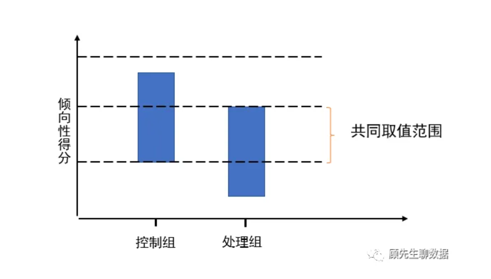

## 使用场景
**严格定义**：主要用于处理观察性临床研究或临床试验研究数据亚组分析，可有效降低混杂偏倚，并在整个研究设计阶段，得到类似随机对照研究的效果，评估的因果效应是ATT（干预组的因果效应）。

**业务场景**：在实际运营活动中，如果不存在RCT条件，并且需要对某个干预（活动上线、组件更新）估因果效应，则可以考虑该方法，但需要注意该方法仍然无法完全排除混淆变量、数据偏差带来的影响，属于次一等的观察评估方法。

**局限性**：
- 观察数据类型的因果推断方法，无法排除混淆变量、数据偏差带来的影响。
- 模型样本如果较少，难以使用该方法。在参考文献中有提到如果匹配完的处理组与对照组有80%的样本量，则认为样本具备代表性。

### 假设
需要满足2个条件：
- 条件独立性(CIA)假设：是指观察对象对处理的选择只受所考虑的协变量的影响，不受未考虑的协变量影响，
- 组间评分分布具有足够大的重叠区域。PSM通过处理组和对照组的评分进行匹配，因此样本量足够大且协变量取值相近，才能使两组的评分分布存在较大的重叠区域。不满足条件的将被剔除。

## PSM详细步骤
PSM方法包括以下步骤：
- 数据处理
    - 数据类型分布：包括数据应该是数字类型还是非数字类型，数字类型通常包括连续数字、非连续数字类型
    - 数据是否缺失，空值的分布如何，如何填充
    - 特征是否唯一等
    - 特征分布如何？是否符合正太分布，是否要调整
    - 数据相关性矩阵
    - 数据是否要标准化
- 特征选择
    - 选取原则：包括同时影响干预变量和因变量的混淆变量；不应该只包括受干预变量影响的变量
    - 举例：
- 倾向分计算
    - 与AB方法类似，PSM是用p-score来拉齐用户的‘AA阶段’，此处由于并未上线实验，我们称之为‘观察阶段’。然后选取观察阶段的用户特征，对用户是否产生干预进行预测，最终对用户进行打分。常用的方法有logistic回归、xgboost，通常认为模型的选型、准确率对于效果影响不大，AUC更高确实效果更好些。
- 匹配
    - 匹配用户的得分，选择原始倾向分$e(x)$ 或者 $ln(e(x))/(1-e(x))$
    - 秉持着 下一个通用结论的思路，筛选倾向性分数极端的用户，例如保留$e(x)$ 在$[e_{min},e_{max}]$ 或者取实验组和对照组交集。
    - nearest neighbors: 进行1对k有放回或无放回匹配
    - radius: 对某个实验组用户，匹配上所有得分差异小于指定radius的用户。
- 平衡性检查
    - 比较直观的是看倾向性得分在匹配前后的分布、以及特征在匹配前后的 QQ-Plot。
    - 或者采用量化指标（SMD）， （实验组均值- 对照组均值）/实验组标准差，如果SMD$<=0.1$通常认为配平质量可以接受，反之则需要根据经验判断。
- 干预效果评估
    - 最简单的方法就是实验组-对照组；
    - 或者拟合$Y=\sigma T + X$ 线性回归方法，然后以T的系数作为干预效果
- 敏感性检验（稳定性检验）
    - 安慰剂检验：通常选择以其他观察点，作为判断点，如果出现类似结果，即可认为结论不够稳定；
    - 通过增加可能存在的混淆变量，判断前后的结论是否一致，如果不一致或者多次变化，则不够稳健

## Code 

## Reference
- https://www.zhihu.com/tardis/zm/art/549298344?source_id=1003
- https://zhuanlan.zhihu.com/p/581467445
- https://dango.rocks/blog/2019/01/20/Causal-Inference-Introduction2-Propensity-Score-Matching/