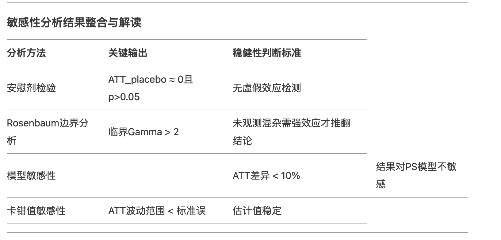

## casual effect evaluation
为了更加系统的分析各种因果推断方法的效果评估能力差异，我们选择在相同的数据进行因果效应评估，横向对比，具体效果如下：

- lalonde 数据集

|  因果评估方法     | 因果效应 |
| ----------- | ----------- |
| 实验组-控制组      | 1794       |
| IPW调整   | 1542        |
| PSM:logistic-KNN   | 1816        |

## Sensitivity Analysis
敏感性分析（Sensitivity Analysis） 是因果推断和统计建模中用于评估研究结果**稳健性（Robustness）**的关键工具。它的核心目标是回答以下问题：“当研究假设不完美成立时，结论会在多大程度上发生改变？” 思考多个维度可能推翻当前假设的可能情况，然后进行提前检测稳健型。

在观察性研究（如经济学、医学、社会科学）中，敏感性分析尤为重要，因为研究者无法像随机对照试验（RCT）一样完全控制混杂因素。以下是敏感性分析的详细解析：

一. 敏感性分析的核心作用
1. 评估未观测混杂的影响
验证结果是否可能被未测量的混杂变量（Unobserved Confounders）所扭曲。
例如：研究“教育年限对收入的影响”时，未观测的“个人能力”可能同时影响教育和收入。
    - Rosenbaum边界分析,量化需要多大的未观测混杂效应才能推翻当前结论。核心参数：Gamma（Γ），表示未观测混杂对处理分配的影响强度。例如：当Γ=2时，说明存在一个使处理概率翻倍的未观测变量，若此时结论仍成立，则结果稳健。
    
    - E值（E-Value）表示能解释观察到的效应所需未观测混杂的最小关联强度。E值越大，结果越稳健（通常E>1.5认为可信）。

2. 检验模型假设的依赖性
分析结果对模型选择（如倾向得分模型、函数形式）的敏感程度。例如：使用逻辑回归 vs 随机森林估计倾向得分时，效应估计是否一致？**本质上**希望探究当前的效果是否是与具体的模型捆绑。

3. 量化参数不确定性
观察关键参数（如卡钳值、匹配比例）变化时，结论的稳定性。
例如：PSM中调整卡钳值（Caliper）后，ATT效应量是否显著变化？**本质上**探究当前的效果是否与模型使用中的参数捆绑。

在实际操作过程中，需要有以下检测：

具体敏感性检测方法参考[PSM实战.ipynb](https://github.com/crazicoco/dsArsenal/blob/main/casual%20inference/Observation%20data/casual%20effect%20evaluation/PSM/PSM%E5%AE%9E%E6%88%98.ipynb)