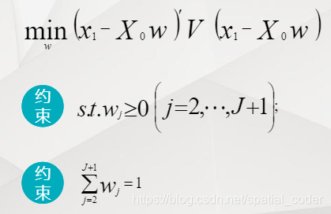

## 使用场景
常规下我们认为的SCM是指合成控制法，通过结合其他同类型数据，基于面板数据的支撑下，构建一个反事实曲线，最后通过曲线差评估因果效应。面板数据特征主要包括：**面板数据兼具了横截面数据和时间序列数据的特点，即有横截面维度（在同一时间段内有多个观测样本），又有时间序列维度（同一样本在多个时间段内被观测到）**

**面板数据tick**：如果面板数据存在断开的时间线，则该数据仍然属于面板数据，但是需要注意该面板是不平衡的面板，需要进行矫正。

## 假设
- 干预前拟合良好
- 控制组池的“可合成性”
- 无预期效应
- 时间稳定性
-  数据生成过程的一致性

## SCM详细步骤

总体来看，合成控制法思想是对于处理组，选择与处理组具有相似特征且未受到政策干预的控制组。通过对若干个控制区进行线性组合，构造一个近似处理组的合成控制区域。对于未受政策影响的潜在控制组，通过权重向量给控制组内每个控制区域一个权重值，以组成合成控制地区。权重向量各元素非负且和为1。

1. 确定数据形式是否是面板数据形式；
2. 数据处理；
3. 模型拟合；
4. 模型评估；
5. 稳健性检测（敏感性检测）：在实际评估时，一般可以通过两类方式分析敏感性，包括一类方法的多种敏感性检测方法，包括安慰剂、模型敏感性、参数敏感性检测等（参考PSM方案）；采用多种方式做评估，增强评估量级的鲁棒性。

## Code 
包括2个实现版本，
1. 基于SyntheticControlMethods 组件的调用版本，本地实现未成功，推测与机器有关；
2. 拆解原理版本，只有最简单的时间、分组flag、y，用于理解。

https://github.com/crazicoco/dsArsenal/blob/main/casual%20inference/Observation%20data/casual%20effect%20evaluation/SCM/SCM.ipynb

## 参考

1. https://nbviewer.org/github/OscarEngelbrektson/SyntheticControlMethods/blob/master/examples/user_guide.ipynb

2. https://blog.csdn.net/spatial_coder/article/details/117197897